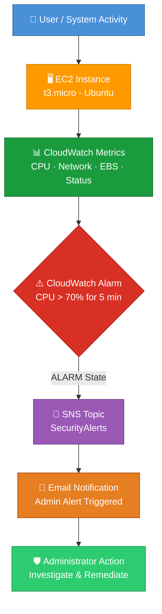
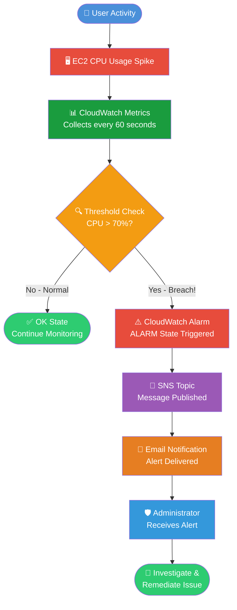

# 🚀 AWS Cloud Security Monitoring and Alerting System

<div align="center">


[](https://github.com)
[](https://github.com)
[](https://aws.amazon.com)
[](LICENSE)

**👨‍💻 Author:** Madhukar Pendalwar &nbsp;|&nbsp; **☁️ Platform:** Amazon Web Services &nbsp;|&nbsp; **📅 Project Level:** Beginner → Intermediate

</div>

---

## 📌 Project Overview

> **A real-time cloud security monitoring and alerting solution built entirely on AWS.**

This project demonstrates how multiple AWS cloud services can be seamlessly integrated to build a **secure, automated monitoring and alerting environment**. From infrastructure deployment to intelligent alerting, this system covers the complete lifecycle of cloud security operations — making it ideal for aspiring Cloud Security Engineers and DevOps practitioners.

The project showcases detection of system anomalies, infrastructure monitoring, activity logging, and automated administrator notifications — all implemented using AWS-native services.

### 🛠️ Technologies & Services Used

| Category | Technology |
|----------|-----------|
| 💻 Compute | Amazon EC2 (t3.micro) |
| 🐧 Operating System | Ubuntu Linux |
| 🌐 Web Server | Nginx |
| 🔍 Audit Logging | AWS CloudTrail |
| 📊 Monitoring | Amazon CloudWatch |
| 📣 Notifications | Amazon SNS |
| 💰 Cost Control | AWS Budgets |
| 🔒 Network Security | Security Groups |
| 🔑 Authentication | SSH Key Pair (PEM) |

---

## 🏗️ Architecture Diagram

### 🔔 Monitoring & Alerting Pipeline



### 🗂️ Audit Logging Pipeline

```mermaid
flowchart LR
    A[☁️ AWS Account\nAll Services] -->|API Calls| B[📜 AWS CloudTrail\nEvent Recording]
    B --> C[🪣 S3 Bucket\nLog Storage]
    B --> D[🔍 Event History\nConsole View]
    
    subgraph Captured Events
        E[RunInstances]
        F[CreateSecurityGroup]
        G[CreateBudget]
        H[ConsoleLogin]
    end

    B --> Captured Events

    style A fill:#4A90D9,color:#fff
    style B fill:#FF9900,color:#fff
    style C fill:#1A9C3E,color:#fff
    style D fill:#9B59B6,color:#fff
```

---

## 🎯 Project Objectives

- 🖥️ **Launch** and configure a secure EC2 server on AWS
- 🔥 **Configure** firewall rules using Security Groups
- 🌐 **Deploy** a production-ready Nginx web server
- 📊 **Monitor** infrastructure health metrics in real time
- 📜 **Generate** security and operational audit logs
- ⚠️ **Detect** abnormal CPU usage and resource spikes
- 🤖 **Trigger** automated alerts via CloudWatch Alarms
- 📧 **Send** instant email notifications through SNS

---

## ⚙️ Project Implementation

### Step 1 — 💰 AWS Budget Configuration

To prevent unexpected cloud costs and enforce financial governance from day one:

- ✅ Created a **Monthly AWS Budget** with a defined spending threshold
- ✅ Configured **Billing Alerts** at 80% and 100% of budget
- ✅ Email notifications triggered when thresholds are breached
- ✅ Enabled **Cost Explorer** for detailed usage analysis

> 💡 *Best Practice: Always configure budget alerts before provisioning any cloud resources.*

---

### Step 2 — 🖥️ EC2 Deployment

Launched a lightweight Ubuntu server for the security monitoring environment:

| Parameter | Value |
|-----------|-------|
| Instance Type | `t3.micro` |
| Operating System | Ubuntu 22.04 LTS |
| Public IP | Enabled |
| SSH Access | Enabled (Port 22) |
| Monitoring | Enhanced CloudWatch Monitoring |
| Storage | 8 GB gp3 EBS Volume |

---

### Step 3 — 🔒 Security Group Configuration

Security Groups function as **virtual firewalls** — controlling inbound and outbound traffic at the instance level. Only authorized ports were opened following the **principle of least privilege**.

| Port | Protocol | Source | Purpose |
|------|----------|--------|---------|
| `22` | SSH | Your IP | 🔑 Secure Remote Login |
| `80` | HTTP | 0.0.0.0/0 | 🌐 Website Access |
| `443` | HTTPS | 0.0.0.0/0 | 🔐 Secure Website Access |

> ⚠️ **Security Note:** SSH (Port 22) is restricted to a specific IP address to prevent brute-force attacks from the internet.

---

### Step 4 — 🔑 SSH Key Authentication

Passwordless authentication was implemented using asymmetric key pairs:

- 🗝️ Generated a **PEM key pair** during EC2 launch
- 🔐 Private key stored securely on the local machine
- 🚀 Connected via SSH — **no password authentication required**
- 🛡️ Eliminates brute-force password attack vectors

```bash
# SSH Connection Command
ssh -i "your-key.pem" ubuntu@<EC2-PUBLIC-IP>
```

---

### Step 5 — 🌐 Nginx Web Server Installation

Deployed Nginx as the primary web server to validate HTTP/HTTPS traffic flow:

```bash
# Update package repositories
sudo apt update

# Install Nginx web server
sudo apt install nginx -y

# Start Nginx service
sudo systemctl start nginx

# Enable auto-start on boot
sudo systemctl enable nginx

# Verify Nginx status
sudo systemctl status nginx
```

**✅ Result:** Successfully displayed the **Nginx Welcome Page** via the EC2 public IP address.

---

### Step 6 — 📜 AWS CloudTrail Configuration

CloudTrail provides **complete auditability** of all AWS API activity:

- ✅ Enabled **CloudTrail** across all AWS regions
- ✅ Captured every AWS API call made to the account
- ✅ Logs stored in a dedicated **S3 bucket** for long-term retention
- ✅ **CloudWatch Logs integration** for real-time log streaming

**Sample CloudTrail Events Captured:**

| Event | Description |
|-------|-------------|
| `RunInstances` | EC2 instance launch recorded |
| `CreateSecurityGroup` | Firewall rule creation logged |
| `CreateBudget` | Budget configuration tracked |
| `ConsoleLogin` | AWS Console access logged |
| `AuthorizeSecurityGroupIngress` | Port access rule captured |

---

### Step 7 — 📊 CloudWatch Monitoring

Amazon CloudWatch provides **real-time infrastructure visibility** across all EC2 metrics:

| Metric | Purpose |
|--------|---------|
| 🔴 CPU Utilization | Detect processing spikes |
| 🟢 Network In | Inbound traffic monitoring |
| 🔵 Network Out | Outbound traffic monitoring |
| 🟡 EBS Read Operations | Disk read activity |
| 🟠 EBS Write Operations | Disk write activity |
| ⚪ Status Check Failed | Instance health monitoring |

---

### Step 8 — ⚠️ CloudWatch Alarm

Configured an intelligent alarm to detect resource anomalies automatically:

```
┌─────────────────────────────────────────────┐
│           CloudWatch Alarm Config           │
├─────────────────────┬───────────────────────┤
│ Metric              │ CPUUtilization        │
│ Namespace           │ AWS/EC2               │
│ Threshold           │ Greater than 70%      │
│ Evaluation Period   │ 5 Minutes             │
│ Datapoints          │ 1 out of 1            │
│ Action              │ Send SNS Notification │
│ Alarm State         │ ALARM / OK / INSUFFICIENT│
└─────────────────────┴───────────────────────┘
```

> 🎯 *Purpose: Automatically detect abnormal resource consumption and trigger incident response workflows.*

---

### Step 9 — 📣 SNS Notification Service

Amazon SNS (Simple Notification Service) acts as the **alerting backbone**:

- ✅ Created an **SNS Topic** named `CloudSecurityAlerts`
- ✅ Configured **Email Subscription** for administrator notifications
- ✅ Confirmed email subscription via verification link
- ✅ Linked SNS Topic to CloudWatch Alarm actions

---

### Step 10 — 🧪 Alert Testing & Validation

Simulated a CPU spike to verify the end-to-end alerting pipeline:

```bash
# Install stress testing tool
sudo apt install stress -y

# Generate artificial CPU load for 5 minutes
stress --cpu 2 --timeout 300
```

**Test Results:**
1. 🔴 CPU utilization spiked to **~100%**
2. ⏱️ CloudWatch detected threshold breach after **5 minutes**
3. 🚨 CloudWatch Alarm transitioned to **ALARM state**
4. 📣 SNS Topic triggered email notification
5. 📧 **Email alert delivered** to administrator inbox successfully

---

## 🔄 Alert Workflow



---

## 📊 Cloud Security Features Implemented

- ✅ **Budget Monitoring** — Cost governance and billing alerts
- ✅ **SSH Key Authentication** — Passwordless, certificate-based access
- ✅ **Security Groups** — Virtual firewall with least-privilege rules
- ✅ **CloudTrail Audit Logging** — Complete API activity trail
- ✅ **CloudWatch Monitoring** — Real-time infrastructure metrics
- ✅ **CloudWatch Alarms** — Threshold-based anomaly detection
- ✅ **SNS Notifications** — Automated email alerting pipeline
- ✅ **Nginx Web Server** — HTTP/HTTPS traffic validation
- ✅ **Infrastructure Monitoring** — Multi-metric health dashboards

---

## 🧪 Validation Results

| # | Test Case | Expected Result | Status |
|---|-----------|----------------|--------|
| 1 | EC2 Deployment | Instance running and accessible | ✅ **Passed** |
| 2 | SSH Access | Remote login via PEM key | ✅ **Passed** |
| 3 | Nginx Installation | Welcome page displayed on public IP | ✅ **Passed** |
| 4 | CloudTrail Logging | API events visible in Event History | ✅ **Passed** |
| 5 | CloudWatch Monitoring | All metrics visible on dashboard | ✅ **Passed** |
| 6 | Alarm Triggering | ALARM state on CPU > 70% | ✅ **Passed** |
| 7 | SNS Notification | Topic publishes on alarm | ✅ **Passed** |
| 8 | Email Delivery | Alert received in inbox | ✅ **Passed** |

> 🎉 **100% of validation tests passed successfully!**

---

## 📚 Skills Learned

<table>
  <tr>
    <td>☁️ <strong>AWS EC2 Administration</strong><br/>Launch, configure & manage cloud instances</td>
    <td>🐧 <strong>Linux Server Administration</strong><br/>Ubuntu system management & CLI operations</td>
  </tr>
  <tr>
    <td>🔒 <strong>Cloud Security Fundamentals</strong><br/>Security groups, key auth & least privilege</td>
    <td>📊 <strong>Monitoring & Logging</strong><br/>CloudWatch metrics & CloudTrail audit logs</td>
  </tr>
  <tr>
    <td>🚨 <strong>Incident Detection</strong><br/>Threshold-based anomaly identification</td>
    <td>🤖 <strong>Alert Automation</strong><br/>CloudWatch Alarms + SNS notification chains</td>
  </tr>
  <tr>
    <td>🏗️ <strong>Infrastructure Security</strong><br/>Network-level controls and access management</td>
    <td>🛡️ <strong>Security Operations</strong><br/>End-to-end SOC workflow implementation</td>
  </tr>
</table>

---

## 🎓 Resume Project Description

> **AWS Cloud Security Monitoring and Alerting System** | *Personal Cloud Security Project*
>
> Architected and deployed a comprehensive real-time security monitoring and alerting solution on Amazon Web Services. Provisioned and hardened an Ubuntu EC2 instance with restrictive Security Group firewall rules and SSH key-pair authentication. Deployed an Nginx web server and configured AWS CloudTrail for complete API audit logging across the AWS account. Implemented Amazon CloudWatch monitoring dashboards tracking CPU utilization, network I/O, and EBS operations, with automated CloudWatch Alarms configured to detect resource anomalies exceeding defined thresholds. Integrated Amazon SNS to deliver real-time email alerts to administrators upon alarm triggers. Validated the end-to-end alerting pipeline using stress-testing tools, confirming successful detection, notification delivery, and incident response readiness. Demonstrated proficiency in cloud security fundamentals, infrastructure monitoring, log analysis, and automated incident alerting on AWS.

---

## 📸 Screenshots

<div align="center">

### 🖥️ EC2 Dashboard
```
┌─────────────────────────────────────────────────────────────┐
│  📸  [ Screenshot: EC2 Instance Running - Public IP shown ] │
│       Instance State: ✅ Running | Type: t3.micro           │
└─────────────────────────────────────────────────────────────┘
```
*→ Replace with actual screenshot of EC2 Instances console*

### 🌐 Nginx Welcome Page
```
┌─────────────────────────────────────────────────────────────┐
│  📸  [ Screenshot: Nginx Welcome Page in Browser ]          │
│       URL: http://<EC2-PUBLIC-IP>                           │
└─────────────────────────────────────────────────────────────┘
```
*→ Replace with browser screenshot showing "Welcome to nginx!"*

### 📜 CloudTrail Event History
```
┌─────────────────────────────────────────────────────────────┐
│  📸  [ Screenshot: CloudTrail Event History Console ]       │
│       Events: RunInstances, CreateSecurityGroup visible     │
└─────────────────────────────────────────────────────────────┘
```
*→ Replace with CloudTrail Event History screenshot*

### ⚠️ CloudWatch Alarm
```
┌─────────────────────────────────────────────────────────────┐
│  📸  [ Screenshot: CloudWatch Alarm in ALARM State ]        │
│       Metric: CPUUtilization > 70% | State: 🔴 ALARM       │
└─────────────────────────────────────────────────────────────┘
```
*→ Replace with CloudWatch Alarms console screenshot*

### 📣 SNS Topic
```
┌─────────────────────────────────────────────────────────────┐
│  📸  [ Screenshot: SNS Topic with Email Subscription ]      │
│       Subscription Status: ✅ Confirmed                      │
└─────────────────────────────────────────────────────────────┘
```
*→ Replace with SNS Topic and Subscriptions screenshot*

### 📧 Email Alert
```
┌─────────────────────────────────────────────────────────────┐
│  📸  [ Screenshot: SNS Email Alert in Inbox ]               │
│       Subject: ALARM: "CPUUtilization" in AWS Region        │
└─────────────────────────────────────────────────────────────┘
```
*→ Replace with received email notification screenshot*

</div>

---

## 🔮 Future Enhancements

| Enhancement | Description | Priority |
|-------------|-------------|----------|
| 👤 **AWS IAM Security Hardening** | Enforce MFA, least-privilege policies, and role-based access | 🔴 High |
| 🔐 **Multi-Factor Authentication (MFA)** | Mandate MFA for all IAM users and root account | 🔴 High |
| 🛡️ **AWS GuardDuty** | AI-powered threat detection for malicious behavior | 🟡 Medium |
| ⚙️ **AWS Config** | Continuous resource compliance and configuration tracking | 🟡 Medium |
| 📡 **CloudWatch Agent** | Push custom application and OS-level metrics | 🟡 Medium |
| 📈 **Security Dashboard** | Unified CloudWatch dashboard for all security metrics | 🟢 Low |
| 🔗 **SIEM Integration** | Forward logs to Splunk or Elastic Security for analysis | 🟢 Low |

---

## ⭐ Project Outcome

<div align="center">

```
╔══════════════════════════════════════════════════════════════╗
║          🏆  PROJECT SUCCESSFULLY COMPLETED  🏆              ║
╠══════════════════════════════════════════════════════════════╣
║  ✅  Real-time Infrastructure Monitoring — Operational       ║
║  ✅  AWS CloudTrail Audit Logging — Active & Capturing       ║
║  ✅  Automated CloudWatch Alarms — Configured & Tested       ║
║  ✅  SNS Email Alerting Pipeline — End-to-End Validated      ║
║  ✅  Security Operations Workflow — Demonstrated             ║
╚══════════════════════════════════════════════════════════════╝
```

</div>

This project successfully demonstrates the design and implementation of a **production-grade cloud security monitoring and alerting system** on AWS. By integrating EC2, CloudTrail, CloudWatch, and SNS, the solution provides comprehensive visibility into infrastructure health, full auditability of cloud activity, and automated real-time incident notification.

The project reflects real-world **Security Operations Center (SOC)** practices — including anomaly detection, threshold-based alerting, and automated response workflows — making it directly applicable to roles in Cloud Security Engineering, DevOps, and Site Reliability Engineering.

---

<div align="center">

**Built with ❤️ by Madhukar Pendalwar**

[](https://aws.amazon.com)
[](https://aws.amazon.com/cloudwatch)
[](https://aws.amazon.com/sns)

*⭐ Star this repository if you found it helpful!*

</div>
