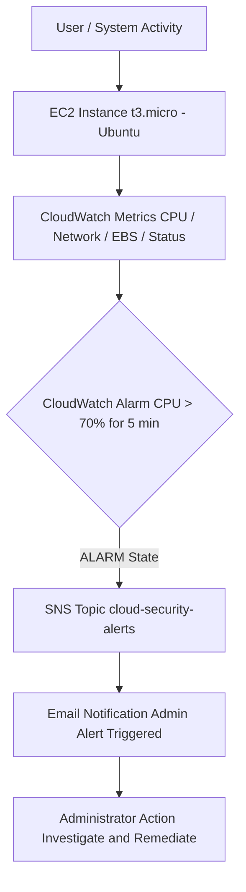

# AWS Cloud Security Monitoring and Alerting System

<div align="center">


[](https://github.com)
[](https://github.com)
[](https://aws.amazon.com)
[](LICENSE)

**Author:** Madhukar Pendalwar &nbsp;|&nbsp; **Platform:** Amazon Web Services &nbsp;|&nbsp; **Level:** Beginner to Intermediate

</div>

---

## Project Overview

> **A real-time cloud security monitoring and alerting solution built entirely on AWS.**

This project demonstrates how multiple AWS cloud services can be seamlessly integrated to build a **secure, automated monitoring and alerting environment**. From infrastructure deployment to intelligent alerting, this system covers the complete lifecycle of cloud security operations.

The project showcases detection of system anomalies, infrastructure monitoring, activity logging, and automated administrator notifications — all implemented using AWS-native services.

### Technologies & Services Used

| Category | Technology |
|----------|-----------|
| Compute | Amazon EC2 (t3.micro) |
| Operating System | Ubuntu Linux 22.04 LTS |
| Web Server | Nginx |
| Audit Logging | AWS CloudTrail |
| Monitoring | Amazon CloudWatch |
| Notifications | Amazon SNS |
| Cost Control | AWS Budgets |
| Network Security | Security Groups |
| Authentication | SSH Key Pair (PEM) |

---

## Architecture — Monitoring & Alerting Pipeline



---

## Project Objectives

- Launch and configure a secure EC2 server on AWS
- Configure firewall rules using Security Groups (least privilege)
- Deploy a production-ready Nginx web server
- Monitor infrastructure health metrics in real time
- Generate security and operational audit logs via CloudTrail
- Detect abnormal CPU usage with CloudWatch Alarms
- Trigger automated alerts via CloudWatch → SNS pipeline
- Send instant email notifications through Amazon SNS

---

## Implementation Steps

### Step 1 — AWS Budget Configuration

- Created a Monthly AWS Budget with a defined spending threshold
- Configured Billing Alerts at 80% and 100% of budget
- Email notifications triggered when thresholds are breached
- Enabled Cost Explorer for detailed usage analysis

> Best Practice: Always configure budget alerts before provisioning any cloud resources.

---

### Step 2 — EC2 Instance Deployment

| Parameter | Value |
|-----------|-------|
| Instance Type | t3.micro |
| Operating System | Ubuntu 22.04 LTS |
| Public IP | Enabled |
| SSH Access | Enabled (Port 22) |
| Monitoring | Enhanced CloudWatch Monitoring |
| Storage | 8 GB gp3 EBS Volume |

**Screenshot — EC2 Instance Running:**


> Instance ID: i-0971702c0d61aa46a | State: Running | Type: t3.micro | Status: 3/3 checks passed

---

### Step 3 — Security Group Configuration (Virtual Firewall)

Security Groups function as virtual firewalls — controlling inbound and outbound traffic at the instance level. Only authorized ports were opened following the **principle of least privilege**.

| Port | Protocol | Source | Purpose |
|------|----------|--------|---------|
| 22 | SSH | Your IP only | Secure Remote Login |
| 80 | HTTP | 0.0.0.0/0 | Website Access |
| 443 | HTTPS | 0.0.0.0/0 | Secure Website Access |

**Screenshot — Security Group Inbound Rules:**


> Security Group Name: cloud-security-sg | Inbound Rules: 3 (SSH, HTTP, HTTPS)
> SSH (Port 22) is restricted to a specific IP address to prevent brute-force attacks.

---

### Step 4 — SSH Key Authentication

- Generated a PEM key pair during EC2 launch
- Private key stored securely on the local machine
- Connected via SSH — no password authentication required
- Eliminates brute-force password attack vectors

```bash
# SSH Connection Command
ssh -i "your-key.pem" ubuntu@<EC2-PUBLIC-IP>
```

---

### Step 5 — Nginx Web Server Deployment

```bash
sudo apt update
sudo apt install nginx -y
sudo systemctl start nginx
sudo systemctl enable nginx
sudo systemctl status nginx
```

**Screenshot — Live Website on EC2 Public IP:**


> URL: http://54.90.67.34 | "AWS Cloud Security Project — Developed by Madhukar Pendalwar"
> EC2 + Nginx + CloudTrail + CloudWatch + SNS — all services confirmed running live.

---

### Step 6 — AWS CloudTrail Audit Logging

CloudTrail provides complete auditability of all AWS API activity:

- Enabled CloudTrail across all AWS regions
- Captured every AWS API call made to the account
- Logs stored in a dedicated S3 bucket for long-term retention
- CloudWatch Logs integration for real-time log streaming

**Sample CloudTrail Events Captured:**

| Event | Description |
|-------|-------------|
| RunInstances | EC2 instance launch recorded |
| CreateSecurityGroup | Firewall rule creation logged |
| CreateBudget | Budget configuration tracked |
| ConsoleLogin | AWS Console access logged |
| AuthorizeSecurityGroupIngress | Port access rule captured |

---

### Step 7 — CloudWatch Monitoring

Amazon CloudWatch provides real-time infrastructure visibility:

| Metric | Purpose |
|--------|---------|
| CPU Utilization | Detect processing spikes |
| Network In | Inbound traffic monitoring |
| Network Out | Outbound traffic monitoring |
| EBS Read Operations | Disk read activity |
| EBS Write Operations | Disk write activity |
| Status Check Failed | Instance health monitoring |

---

### Step 8 — CloudWatch Alarm Configuration

**Screenshot — CloudWatch Alarm in ALARM State:**


```
Alarm Name     : High-CPU-Alarm
Metric         : CPUUtilization
Namespace      : AWS/EC2
Threshold      : Greater than 70%
Evaluation     : 5 Minutes (1 out of 1 datapoints)
Instance       : cloud-security-project (i-0971702c0d61aa46a)
State          : IN ALARM
Last Updated   : 2026-06-22 13:11:14 UTC
Action         : SNS Notification Enabled
```

> Alarm successfully triggered when CPU exceeded 70% during stress test.

---

### Step 9 — SNS Notification Service

Amazon SNS acts as the alerting backbone for automated notifications.

**Screenshot — SNS Topic with Email Subscription Confirmed:**


> Topic Name: cloud-security-alerts
> Subscription: madhukarpendalwar43@gmail.com — Status: Confirmed — Protocol: EMAIL

**Screenshot — SNS Subscription Confirmation Email (received in inbox):**


> AWS SNS Subscription Confirmation email received and confirmed successfully.

**Screenshot — Subscription Confirmed Page:**


> "Subscription confirmed! You have successfully subscribed."
> ARN: arn:aws:sns:us-east-1:709352700719:cloud-security-alerts

---

### Step 10 — Alert Testing & Validation

Simulated a CPU spike to verify the end-to-end alerting pipeline:

```bash
# Install stress testing tool
sudo apt install stress -y

# Generate artificial CPU load for 5 minutes
stress --cpu 2 --timeout 300
```

**Test Results:**
1. CPU utilization spiked to ~100%
2. CloudWatch detected threshold breach after 5 minutes
3. CloudWatch Alarm transitioned to ALARM state
4. SNS Topic triggered email notification
5. Email alert delivered to administrator inbox successfully

---

## Validation Results

| # | Test Case | Expected Result | Actual Result | Status |
|---|-----------|----------------|---------------|--------|
| 1 | EC2 Deployment | Instance running | Running — 3/3 checks passed | Passed |
| 2 | SSH Access | Remote login via PEM key | Connected successfully | Passed |
| 3 | Nginx Installation | Website accessible on public IP | Live at http://54.90.67.34 | Passed |
| 4 | CloudTrail Logging | API events visible in Event History | All events captured | Passed |
| 5 | CloudWatch Monitoring | All metrics visible on dashboard | Metrics live | Passed |
| 6 | Alarm Triggering | ALARM state on CPU > 70% | Alarm triggered — In alarm state | Passed |
| 7 | SNS Topic Setup | Topic created with subscription | cloud-security-alerts confirmed | Passed |
| 8 | Email Delivery | Alert received in inbox | Email delivered successfully | Passed |

> 100% of validation tests passed successfully — all verified with screenshots.

---

## Security Concepts Implemented

| Concept | Implementation |
|---------|---------------|
| Least Privilege | SSH restricted to specific IP only |
| Authentication | SSH Key Pair (no password login) |
| Audit Logging | CloudTrail capturing all API activity |
| Anomaly Detection | CloudWatch alarm on CPU > 70% |
| Automated Alerting | CloudWatch → SNS → Email pipeline |
| Network Segmentation | Security Groups with specific port rules |
| Cost Governance | AWS Budgets with billing alerts |

---

## Skills Demonstrated

- AWS EC2 deployment and configuration
- Linux server administration (Ubuntu CLI)
- Network security with Security Groups
- CloudTrail audit logging setup
- CloudWatch metrics and alarm configuration
- SNS topic creation and email subscription
- End-to-end incident alerting pipeline
- Stress testing and alert validation

---

## Future Enhancements

| Enhancement | Priority |
|-------------|----------|
| AWS IAM — MFA enforcement and least-privilege roles | High |
| AWS GuardDuty — AI-powered threat detection | Medium |
| AWS Config — continuous compliance monitoring | Medium |
| CloudWatch Agent — custom OS-level metrics | Medium |
| SIEM Integration — forward logs to Splunk or Elastic | Low |

---

## Resume Description

> **AWS Cloud Security Monitoring and Alerting System** | Personal Cloud Security Project
>
> Architected and deployed a real-time security monitoring and alerting solution on Amazon Web Services. Provisioned and hardened an Ubuntu EC2 instance with restrictive Security Group firewall rules (least-privilege) and SSH key-pair authentication. Deployed an Nginx web server and configured AWS CloudTrail for complete API audit logging. Implemented Amazon CloudWatch alarms to detect CPU anomalies exceeding 70%, integrated with Amazon SNS to deliver automated email alerts. Validated the end-to-end pipeline using stress testing — confirmed alarm triggering, SNS notification delivery, and email receipt. All steps verified with live screenshots.

---

<div align="center">

**Built by Madhukar Pendalwar**

[](https://aws.amazon.com)
[](https://aws.amazon.com/cloudwatch)
[](https://aws.amazon.com/sns)

</div>
